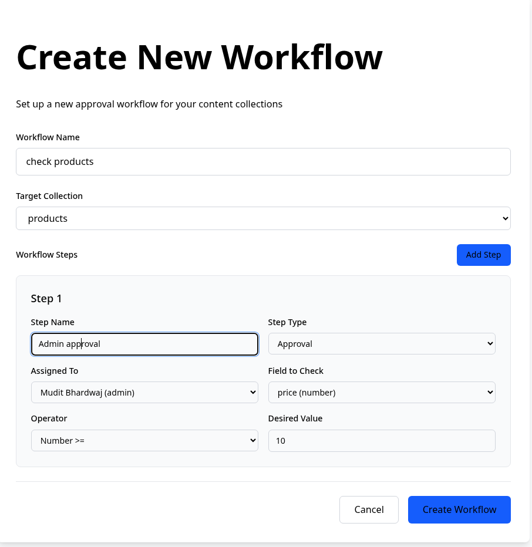
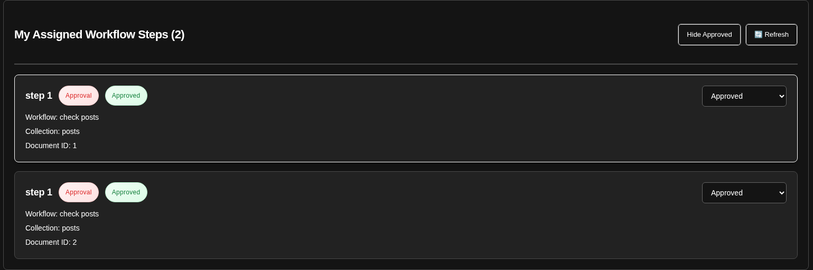

# Dynamic Workflow Engine

## Setup Instructions

`You must have docker installed on your device. Navigate to the root folder of your project.`

```bash
docker compose up &    
docker exec -it plcms-con /bin/sh # This will connect your terminal to the docker container
npm install # install the dependencies
npm run dev # You will have to set up .env variable for your database before this. I used neonDb btw. 
```

## Architecture

### Workflow Collection

```ts
 fields: [
    {
      name: 'name',
      type: 'text',
    },
    {
      name: 'collection_name',
      type: 'text',
    },
    {
      name: 'steps',
      type: 'array',
      fields: [
        { name: 'step_name', type: 'text' },
        {
          type: 'select',
          name: 'type',
          options: ['approval', 'review', 'sign-off', 'comment-only'],
        },
        {
          type: 'relationship',
          relationTo: 'users',
          name: 'assigned_to',
        },
        {
          name: 'field_name',
          type: 'text',
        },
        {
          type: 'select',
          name: 'operator',
          options: [
            { label: 'Text Length Equals', value: 'text:length:equals' },
            { label: 'Text Length >=', value: 'text:length:greaterThanEqualsTo' },
            { label: 'Text Length <=', value: 'text:length:lessThanEqualsTo' },
            { label: 'Text Length >', value: 'text:length:greaterThan' },
            { label: 'Text Length <', value: 'text:length:lessThan' },
            { label: 'Text Starts With', value: 'text:startsWith' },
            { label: 'Text Ends With', value: 'text:endsWith' },
            { label: 'Text Contains', value: 'text:contains' },
//                        .
//                        .
//                        .
          ],
        },
        {
          name: 'desiredValue',
          type: 'text',
        },
      ],
```

The steps field stores the array of steps which in turn stores the condition to be evaluated for the auto-approval of documents of the collections. This works dynamically and is not hard coded into the targeted collections themselves.

### Workflow Status

This is the collection that actually store the status of each document of the collection.

```ts
  fields: [
    {
      name: 'workflow_id',
      type: 'relationship',
      relationTo: 'workflows',
    },
    {
      name: 'doc_id',
      type: 'text',
    },
    {
      name: 'step_id',
      type: 'text',
    },
    {
      name: 'step_status',
      type: 'radio',
      options: ['approved', 'rejected', 'pending'],
    },
  ],
```



As soon as a workflow is created, a hook is registered on the target Collection (i.e. Posts, Contracts) which looks for any changes, if any changes occur it trigger the workflow engine which evaluates the conditions established on the creation of workflow and changes the status in the WorkflowStatus collection.

### Workflow Logs

```ts
access: {
    read: isStaff,
    create: isStaff,
    update: noOne,
    delete: noOne,
    unlock: noOne,
  },
  fields: [
    {
      name: 'initiator',
      relationTo: 'users',
      type: 'relationship',
    },
    {
      name: 'collectionAffected',
      type: 'text',
    },
    {
      name: 'documentAffected',
      type: 'text',
    },
    {
      type: 'text',
      name: 'prevStatus',
    },

    {
      type: 'text',
      name: 'curStatus',
    },
  ],
```

We also have the workflow Logs which can only be read and written into. Its documents can't be deleted or updated.

### Workflow Status in Admin UI



Also added this custom component to admin UI which shows the workflow steps that the user is assigned to. The user can change the status(s) in this UI.
